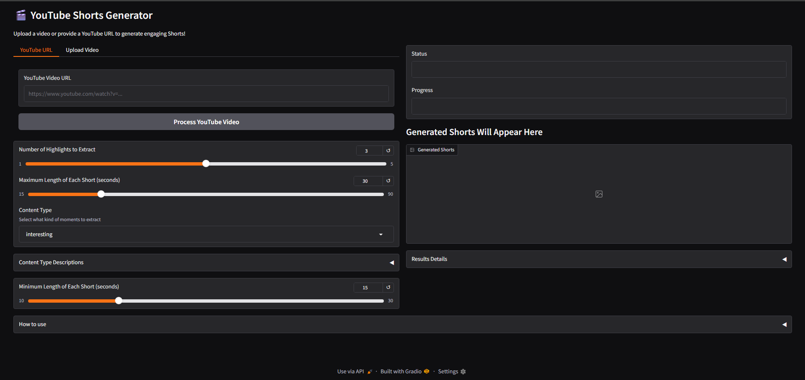
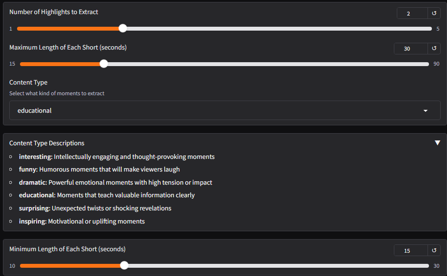
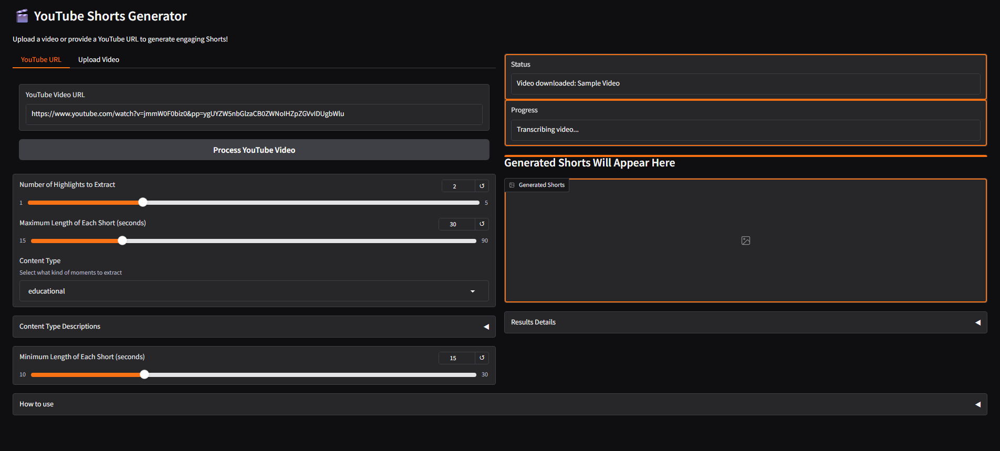
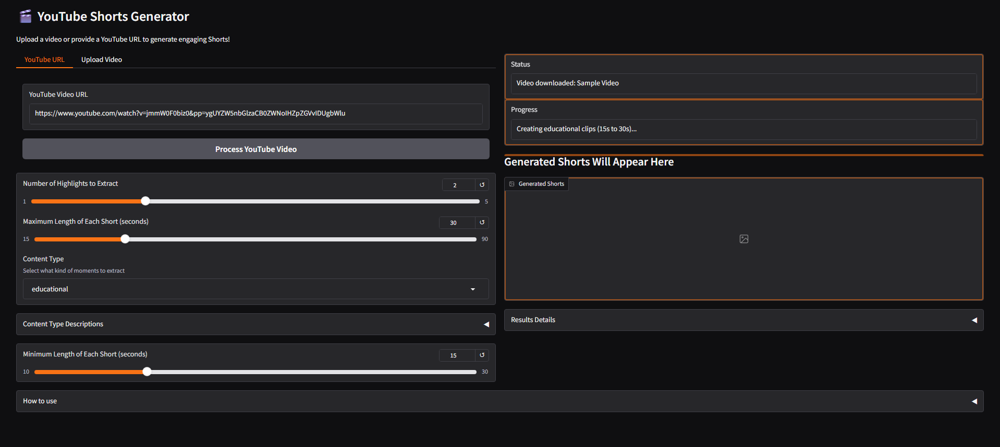
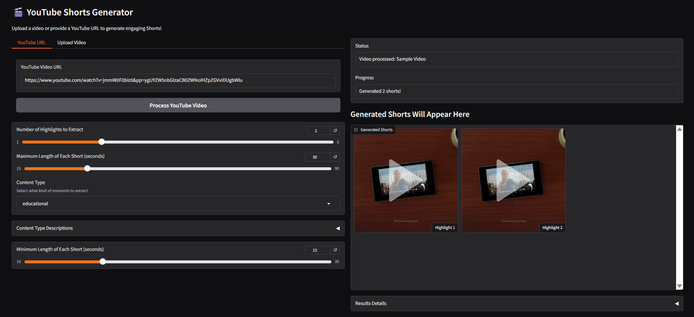
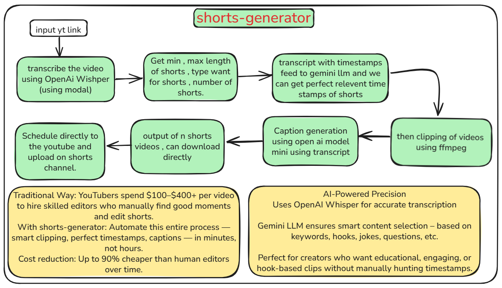

# 🎬 YouTube Shorts Generator — *AI-Powered Highlights to Viral Clips*

> **Track:** `agent-demo-track`  
> ✨ Turn long-form videos into scroll-stopping YouTube Shorts using AI — fast, accurate, and automated.

---

## 🧠 Overview

**YouTube Shorts Generator** transforms long videos into engaging, high-quality Shorts using AI. It automates the entire process — from transcription and highlight detection to clipping and captioning — saving creators hours of editing time and thousands in production cost.

Whether you're an educator, podcaster, or content creator, this tool helps you repurpose long content into viral-ready clips for platforms like **YouTube Shorts**, **Instagram Reels**, and **TikTok**.

---

## 🎥 Demo Video

👉 [🔗 Watch the Demo](https://youtu.be/PvXmVN5Y23M)

  
  
  
  


---

## 🚀 Features

- ✅ **Smart Highlight Detection**: Automatically selects attention-grabbing moments based on content type.
- ✅ **Flexible Clip Duration**: Generate 15–90 second videos tailored to platform requirements.
- ✅ **Multiple Content Modes**: Choose from `Educational`, `Funny`, `Dramatic`, `Surprising`, `Inspiring`, etc.
- ✅ **Accurate Transcription**: Powered by OpenAI Whisper for top-tier audio-to-text performance.
- ✅ **AI-Generated Captions & Titles**: Enhance engagement with catchy, context-aware overlays.
- ✅ **Seamless YouTube Integration**: Process videos from a simple YouTube URL.
- ✅ **Download or Auto-Schedule**: Direct download or schedule uploads to your Shorts channel.

---

## 🧰 Tech Stack

- **Python 3.9+**
- **Gradio** (for web UI)
- **FFmpeg** (video slicing)
- **OpenAI Whisper** (transcription)
- **OpenAI GPT / Gemini LLM** (caption generation, timestamp detection)
- **Modal** (cloud deployment & serverless compute)

---

## 🏗️ Architecture



### 📦 Pipeline:

1. **Input**: YouTube link or local file  
2. **Transcription**: Whisper model extracts accurate timestamped transcript  
3. **Analysis**: Gemini/GPT filters highlights based on selected content style  
4. **Clipping**: FFmpeg trims segments using timestamps  
5. **Captioning**: Catchy captions & hashtags generated  
6. **Output**: Final clips ready to download or publish

---

## 🧪 How to Use

### ⚙️ Prerequisites

- Python 3.9+
- FFmpeg installed & added to `PATH`
- OpenAI API Key

---

### 💻 Installation

```bash
git clone https://github.com/VanshGoyal000/shorts-generator
cd shorts-generator
pip install -r requirements.txt
3. Create a `.env` file with your API keys:
   ```
   OPENAI_API_KEY=your_key_here
   ```

### Running the Application

There are two ways to run the application:

1. **Local Processing (Recommended for beginners)**:
   ```bash
   python run.py
   ```
   This launches a Gradio web interface that processes videos locally.

2. **Modal Processing (More powerful, requires Modal account)**:
   ```bash
   python modal_deploy.py  # First deploy the Modal app
   python run_modal.py     # Then run the Gradio interface using Modal
   ```

## 📊 Stats / Results
- Average processing time: ~3-5 minutes per video
- Supports videos up to 3 hours long
- 6 different content types for targeted short creation
- Clip duration range: 15-90 seconds (customizable)

## 👤 Team
- Vansh Goyal (Lead Developer)
- github.com/VanshGoyal000
- linkedin.com/in/vanshcodeworks

## Usage Tips

1. For the best results, select the appropriate content type that matches your video (funny, educational, etc.)
2. Variable-length clips are more engaging than fixed-length clips
3. Adjust the min/max duration based on your platform requirements
4. Try different numbers of highlights to get the best moments from your video

## Troubleshooting

- If you see "ConnectionResetError" messages on Windows, these are harmless and can be ignored
- If video processing fails, try clearing the cache in `%TEMP%/shorts_generator_cache`
- Check that FFmpeg is properly installed and accessible from your PATH

## 🏆 Submission Tags
- `agent-demo-track`
- `🤖 Gradio Agents & MCP Hackathon 2025 🚀`
